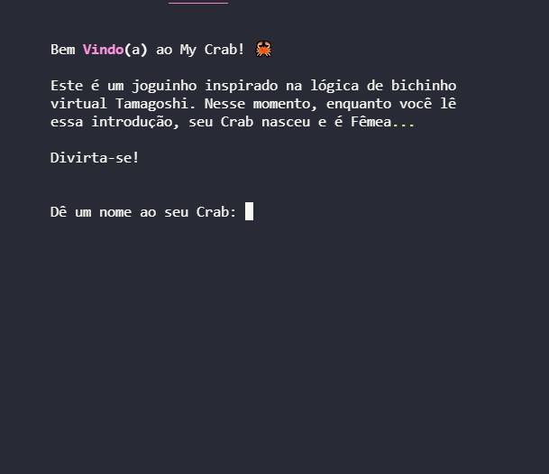
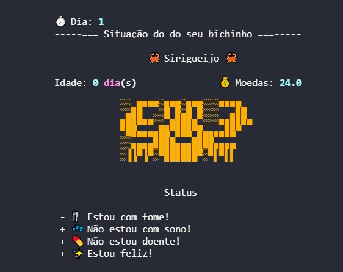

<h1 align="center">Blue EdTech - Módulo I</h1>
<h3 align="center">Projeto final - Ficção Interativa</h2>

&emsp;Projeto final do curso de certificação da Blue EdTech apresentado avaliação do final do módulo I - Lógica de programação - sobre um jogo de ficção interativa usando todos os conceitos aprendidos no decorrer do módulo. Como requisito obrigatório, neste projeto foi feito o uso de classe. O trabalho foi desenvolvido em grupo.

---

Este é o jogo de ficção interativa My Crab. Nele sua missão é única: sobreviver o máximo de dias possiveis.

Dê um nome ao seu Crab e veja a ação acontecer. Não espere muita moleza, coisas ruins vão acontecer.

##### Equipe:
 - 
<a href="https://github.com/Akyllesbarros" title="Akylles Barros Github">Akylles Barros</a>

 - 
<a href="https://github.com/ArseniumGX" title="José P. Macedo Github">José P. Macedo</a>

 - 
<a href="https://github.com/vitinop" title="Victor Fernado Github">Victor Fernando</a>

  
  

